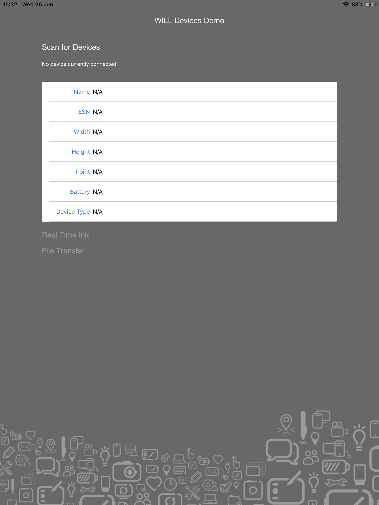

# Getting Started 

## Development Environment

The Wacom Ink SDK for devices requires Xcode 10 or higher

To test the application use a Wacom device such as a Bamboo Slate, Folio, Intuos Pro or PHU-111 Clipboard.

## Download the WILL SDKs

The sample application requires two SDKs from the website:
* CDL for iOS
* WILL SDK for Ink


Download the SDKs from https://developer.wacom.com/developer-dashboard

* login using your Wacom ID
* Select **Downloads for devices**
* Download **Wacom Ink SDK for devices for iOS**
* Accept the End User License Agreement to use the SDK
* Select **Downloads for ink**
* Download **WILL SDK for Ink for iOS(version 2.0)**
* Accept the End User License Agreement to use the SDK

The downloaded Zip file for CDL for iOS contains the SDK with documentation.
The SDK files are contained in the folder 'sdk' containing:

* WILLDevices.framework
* WILLDevicesCore.framework
* WacomLicensing.framework
* WILLInk.framework
                    


## Download an evaluation license

A license is needed to use the CDL and a fully functional evaluation license is free to download as follows:

* Navigate to https://developer.wacom.com/developer-dashboard
* login using your Wacom ID
* Select **Licenses**
* Select **New Evaluation License**
* Select **Generate Evaluation License** for Wacom Ink SDK for devices
* Return to Licenses where the new license file is ready for download
* Download the license file

The license is supplied as a JWT text string in a text file. This will need to be copied into your application. The self-service evaluation licenses have a three-month expiry date from the time of creation. However you can generate a new license at any time. 


## Build the sample application

Separate samples are included in Sample-code:

* WILLDevicesSample (Swift)
* WILLDevicesSample-ObjC (Objective C)

To build the samples:

* Run the Xcode sample app (Swift or Objective C) from the Sample-code directory
* The project already has all the frameworks it needs and it's ready for use
      

Run the application to display the main window:

    

* Connect a suitable Wacom device to the app - for example a Bamboo Slate, Folio or PHU-111 Clipboard
* Click [Scan for Devices]
* A list of available devices will be displayed
* Select the device name to connect to the CDL device 
* Select [Real Time Ink] to display the pen trace in real-time or [Transfer File] to transfer ink documents from the device.


# Common Device Library Sample Application

## 1. Scan, Connect and Get Properties

### 1.1 Initialize License

You will need a CDL license, issued for your application. The easiest way to initialize your license is to add it as a string to your application and then verify it using ```LicenseValidator```.

```swift
do {
    try LicenseValidator.sharedInstance.initLicense(licenseString)
} catch let e as LicenseValidationException {
    //TODO: Handle the error
} catch let e as LicenseRuntimeError {
    //TODO: Handle the error
} catch {
    //TODO: Handle the error
}
```

### 1.2. Scan for Wacom Ink Devices

In order to find the available Wacom Ink Devices start a scan. To do this create a new instance of ```InkDeviceWatcher```. It will scan for Wacom Ink Devices over bluetooth. The devices should be in pairing mode in order to be found.
* **Note:** To enter pairing mode on a Wacom SmartPad press and hold the button on the device for 6 seconds.*

The constructor of the  ```InkDeviceWatcher``` takes no parameters.

```swift
let deviceWatcher = InkDeviceWatcher()
```

To start scanning for devices, call the ```start()``` method of the ```InkDeviceWatcher```. The watcher instance has a .delegate property that should conform to the ```InkDeviceWatcherDelegate``` protocol. Any changes to the list of the available devices nearby will be reported through the protocol functions.

When the watcher finds a device, it is reported as ```InkDeviceInfo```. This object provides useful information such as the device name, device Id and type.

```swift
inkWatcher.delegate = self
inkWatcher.start()
```

When scanning is complete you should stop the watcher.

```swift
inkWatcher.stop()
```

### 1.3. Connect to Wacom Ink Device

The ```connectToDevice``` method takes three parameters:

* ```inkDeviceInfo``` - the information about the device (found during scan or persisted from previous usages).
* ```appId``` - a unique identifier of the application. It is used by the Ink devices to pair with the application.
* ```callback``` - the callback through which to be notified once the connection was successfully established.

```swift
do {
	let currentInkDevice = try InkDeviceManager.connectToDevice(deviceInfo, appID: "CDLTestApp", deviceStatusChangedHandler: { (oldStatus, newStatus) -> (Void) in
		//TODO: Handle the status change
	})
} catch let error {
	//TODO: Handle the error
}
```

When you have finished with the ink device, or if you need to create a new client, you should first disconnect it:

```swift
currentInkDevice.disconnect(shouldPreserveState: true)
```

### 1.4. Device Services

There are certain things that a Wacom Ink Device can do but in most cases there are differences between one device and another. In CDL these features are described by ```DeviceService```. To check if a device supports a given service you can use ```getService``` which will return a service instance in case it supports it and throw an error in case it doesn't. The ```getService``` function expects an ```InkDeviceServiceType``` instance as a parameter.


```swift
do {
	try self.fileService = self.inkDevice?.getService(.fileTransfer) as? FileTranserService
} catch let error {
	// TODO: Handle the error
}
```

Some of the Device Services (such as ```FileTranserService``` and ```RealTimeInkService```) cannot work in parallel - if one of them is enabled, the other cannot be started until the first one is stopped.

Other means to subscribe for device events such as change in the battery state or a button being pressed are using one of the following ```SmartPadInkDevice``` properties: 

```swift
public var deviceBatteryStateChanged: ((Int, Bool) -> (Void))?

public var deviceStatusChanged: ((DeviceStatus, DeviceStatus) -> (Void))?

public var barcodeScanned: ((String) -> (Void))?

public var deviceDisconnected: (() -> Void)?

public var buttonPressed: (() -> Void)?
```
```swift
currentInkDevice?.buttonPressed = {
	//TODO: Handle the event
}
```

Ink devices have properties which describe some of their characteristics such as name, battery state, id and other. You can easily acquire them using the ```getProperties``` method, passing a ```List``` of the properties you are interested in. The callback should be called once for each of the requested properties. It has 3 parameters: ```DeviceParameter, Any?, Error?```


```swift
do {
	let parametersToGet: [DeviceParameter] = [.deviceName, .pointSize, .batteryLevel, .deviceType, .width, .height, .deviceSerial]

	try self.currentInkDevice?.getPropertiesAsync(parametersToGet, completionHandler: {                         		(parameter, value, error) -> (Void) in
		//TODO: Handle each of the requested parameters
    })
} catch let error {
	//TODO: Handle the error
}
```

## 2. FileTransfer - Transfer Files From Ink Device

In this section, we want to receive and preview all the files created with the Wacom Ink Device. To do so, after making sure that the ```FileTransferService``` is supported by the current device, we should get its instance:

```swift
do {
	let fileService = try self.inkDevice?.getService(.fileTransfer) as? FileTranserService
	fileService?.dataReceiver = self
} catch let error {
	//TODO: Handle the error
}
```

and start it:


```swift
do {
	try self.fileService?.start(provideRawData: true) {success, error in
	    //TODO: Check if the service was started successfully and continue with other logic
    }
} catch let error {
	//TODO: Handle the error
}
```

The class containing the service must conform to the ```FileDataReceiver``` protocol. It has 3 functions:

- ```noMoreFiles``` - Called when there are no more files available for download from the device
- ```receiveFile``` - The file data will be provided to this delegate method
- ```errorWhileDownloadingFile``` - An error occurred during file download

After receiving a file the receiver should return an appropriate status (```FileDataReceiverStatus```) dependent on whether the processing of the file was successful or not.

```swift
case resendLast
case cancel
case fileSaved
```

## 3. LiveMode - Get Real Time Inking

### 3.1 Receive ink data

In this section, we would like to receive the data created on the Ink Device in real time.
The first thing is to make sure that this feature is supported by the device.
Then we are ready to get the instance of the ```RealTimeInkService```:


```swift
do {
	let realtimeService = try self.inkDevice?.getService(.realtimeInk) as? RealTimeInkService
	realtimeService?.dataReceiver = self
} catch let error {
	//TODO: Handle the error
}
```

and start it:

```swift
do {
	try realtimeService?.start(provideRawData: true) {success, error in
        //TODO: Check if the service was started successfully and continue with other logic
    }
} catch let error {
	//TODO: Handle the error
}
```

The class containing the service must conform to the ```StrokeDataReceiver``` protocol. It has 6 functions:


* strokeBegan - A new ink stroke has started
* strokeMoved - An inkstroke has continued on the device
* strokeEnded - An inkstroke has ended
* hoverStrokeReceived - If the device supports non-contact points, this will be called when a 'hover' stroke has been received
* pointsLost - A number of points have been reported as lost by the device
* newLayerAdded - A new layer of ink strokes has been started

### 3.2 Render ink data

In the sample application the rendering of ink data is achieved using the WILL SDK for Ink.
For details of this process see the documentation and samples:  
[WILL SDK for Ink - Rendering](http://developer-docs.wacom.com/sdk-for-ink/docs/2.0.0/rendering)

---

