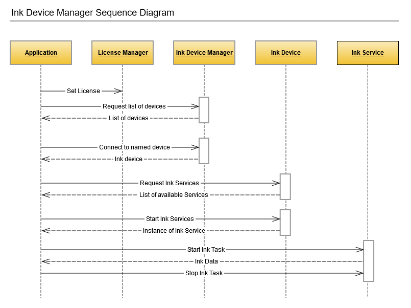

# Wacom Ink SDK for devices - iOS

## Introduction

---

The Wacom Ink SDK for devices incorporates the *Common Device Library* (CDL) supplied as a single library that can handle different types of pen or touch input from Wacom and third-party devices.
The benefits of using the CDL include:

* Less implementation effort for developers: integration of a single library gives support for a range of input devices
* The flexibility to include support for non-Wacom devices in an application
* The freedom to take full advantage of the *Wacom Ink Technologies* digital ink ecosystem to provide high quality digital ink rendering without sacrificing the value of raw pen data needed in processes such as signature verification
* A generic interface relieves the application code from direct control of the connected hardware

Using the library you can:

* Search for available devices
* Connect to a device
* Receive input from a connected device in the WILL Ink format

The CDL is available for a range of development platforms

* Windows (Classic and UWP)
* iOS
* Android

Types of supported devices include:

* Wacom PHU-111 Clipboard
* Wacom Smartpad e.g. Folio, Slate
* Wacom Intuos
* Apple Pencil

Regardless of the development platform and device type a consistent approach is provided for application development:


### Ink Device Watcher
    Use the device watcher to receive a list of named devices that are available for connection
### Ink Device
    Connect to a named device and retrieve properties
### Ink Device Service
    Use the service callback mechanism to receive data from the connected device.
    Depending on the type of device, data can be in the form of realtime pen strokes, or a file transfer of a completed page.

To view operation of the CDL diagrammatically:




## SDK Overview

---

To illustrate the Wacom Ink SDK for devices, the samples which follow are taken from the Swift iOS version of the SDK. A similar approach is followed on all platforms where sample projects are supplied as part of the SDK.

### 1. Initialize License
You will need a Wacom Ink SDK for devices license, issued for your application. The easiest way to initialize your license is to add it as a string to your application and then verify it using ```LicenseValidator```.

```swift
do {
    try LicenseValidator.sharedInstance.initLicense(licenseString)
} catch let e as LicenseValidationException {
    //TODO: Handle the error
} catch let e as LicenseRuntimeError {
    //TODO: Handle the error
} catch {
    //TODO: Handle the error
}
```

### 2. Scan for Wacom Ink Devices

In order to find the available Wacom Ink Devices start a scan. To do this create a new instance of ```InkDeviceWatcher```. It will scan for Wacom Ink Devices over bluetooth. The devices should be in pairing mode in order to be found.
* **Note:** To enter pairing mode on a Wacom SmartPad press and hold the button on the device for 6 seconds.*

The constructor of the  ```InkDeviceWatcher``` takes no parameters.

```swift
let deviceWatcher = InkDeviceWatcher()
```

To start scanning for devices, call the ```start()``` method of the ```InkDeviceWatcher```. The watcher instance has a .delegate property that should conform to the ```InkDeviceWatcherDelegate``` protocol. Any changes to the list of the available devices nearby will be reported through the protocol functions.

When the watcher finds a device, it is reported as ```InkDeviceInfo```. This object provides useful information such as the devices's name, deviceId and type.

```swift
inkWatcher.delegate = self
inkWatcher.start()
```

When scanning is complete you should stop the watcher.

```swift
inkWatcher.stop()
```

### 3. Connect to Wacom Ink Device

The ```connectToDevice``` method takes three parameters:

* ```inkDeviceInfo``` - the information about the device (found during scan or persisted from previous usages).
* ```appId``` - a unique identifier of the application. It is used by the Ink devices to pair with the application.
* ```callback``` - the callback through which to be notified once the connection was successfully established.

```swift
do {
    let currentInkDevice = try InkDeviceManager.connectToDevice(deviceInfo, appID: "CDLTestApp", deviceStatusChangedHandler: { (oldStatus,          newStatus) -> (Void) in
            //TODO: Handle the status change
    })
} catch let error {
    //TODO: Handle the error
}
```

When you have finished with the ink device, or if you need to create a new client, you should first disconnect it:

```swift
currentInkDevice.disconnect(shouldPreserveState: true)
```

### 4. Device Services

There are certain things that a Wacom Ink Device can do but in most cases there are differences between one device and another. In CDL these features are described by ```DeviceService```. To check if a device supports a given service you can use ```getService``` which will return a service instance in case it supports it and throw an error in case it doesn't. The ```getService``` function expects an ```InkDeviceServiceType``` instance as a parameter.


```swift
do {
    try self.fileService = self.inkDevice?.getService(.fileTransfer) as? FileTranserService
} catch let error {
    // TODO: Handle the error
}
```

Some of the Device Services (such as ```FileTranserService``` and ```RealTimeInkService```) cannot work in parallel - if one of them is enabled, the other cannot be started until the first one is stopped.

Other means to subscribe for device events such as change in the battery state or a button being pressed are using one of the following ```SmartPadInkDevice``` properties: 

```swift
public var deviceBatteryStateChanged: ((Int, Bool) -> (Void))?

public var deviceStatusChanged: ((DeviceStatus, DeviceStatus) -> (Void))?

public var barcodeScanned: ((String) -> (Void))?

public var deviceDisconnected: (() -> Void)?

public var buttonPressed: (() -> Void)?
```
```swift
currentInkDevice?.buttonPressed = {
	//TODO: Handle the event
}
```

Ink devices have properties which describe some of their characteristics such as name, battery state, id and other. You can easily acquire them using the ```getProperties``` method, passing a ```List``` of the properties you are interested in. The callback should be called once for each of the requested properties. It has 3 parameters: ```DeviceParameter, Any?, Error?```


```swift
do {
	let parametersToGet: [DeviceParameter] = [.deviceName, .pointSize, .batteryLevel, .deviceType, .width, .height, .deviceSerial]
	try self.currentInkDevice?.getPropertiesAsync(parametersToGet, completionHandler: { (parameter, value, error) -> (Void) in
		//TODO: Handle each of the requested parameters
	})
} catch let error {
	//TODO: Handle the error
}
```

### 4.1. FileTransfer- Transfer Files From Ink Device

In this section, we want to receive and preview all the files created with the Wacom Ink Device. To do so, after making sure that the ```FileTransferService``` is supported by the current device, we should get its instance:

```swift
do {
    let fileService = try self.inkDevice?.getService(.fileTransfer) as? FileTranserService
    fileService?.dataReceiver = self
} catch let error {
  //TODO: Handle the error
}
```

and start it:


```swift
do {
	try self.fileService?.start(provideRawData: true) {success, error in
        //TODO: Check if the service was started successfully and continue with other logic
	}
} catch let error {
  //TODO: Handle the error
}
```

The class containing the service must conform to the ```FileDataReceiver``` protocol. It has 3 functions:

- ```noMoreFiles``` - Called when there are no more files available for download from the device
- ```receiveFile``` - The file data will be provided to this delegate method
- ```errorWhileDownloadingFile``` - An error occurred during file download

After receiving a file the receiver should return an appropriate status (```FileDataReceiverStatus```) dependant on whether the processing of the file was succesful or not.

```swift
case resendLast
case cancel
case fileSaved
```

### 4.2. LiveMode - Get Real Time Inking

In this section, we would like to receive the data created on the Ink Device in real time.
The first thing is to make sure that this feature is supported by the device.
Then we are ready to get the instance of the ```RealTimeInkService```:


```swift
do {
    let realtimeService = try self.inkDevice?.getService(.realtimeInk) as? RealTimeInkService
    realtimeService?.dataReceiver = self
} catch let error {
    //TODO: Handle the error
}
```

and start it:

```swift
do {
	try realtimeService?.start(provideRawData: true) {success, error in
		//TODO: Check if the service was started successfully and continue with other logic
	}
} catch let error {
    //TODO: Handle the error
}
```

The class containing the service must conform to the ```StrokeDataReceiver``` protocol. It has 6 functions:


* strokeBegan - A new ink stroke has started
* strokeMoved - An inkstroke has continued on the device
* strokeEnded - An inkstroke has ended
* hoverStrokeReceived - If the device supports non-contact points, this will be called when a 'hover' stroke has been recevied
* pointsLost - A number of points have been reported as lost by the device
* newLayerAdded - A new layer of ink strokes has been started

---


# Additional resources 

## Sample Code
For further samples check Wacom's Developer additional samples, see [https://github.com/Wacom-Developer](https://github.com/Wacom-Developer)

## Documentation
For further details on using the SDK see [Wacom Ink SDK for devices documentation](http://developer-docs.wacom.com/sdk-for-devices/) 

The API Reference is available directly in the downloaded SDK.

## Support
If you experience issues with the technology components, please see related [FAQs](http://developer-docs.wacom.com/faqs)

For further support file a ticket in our **Developer Support Portal** described here: [Request Support](http://developer-docs.wacom.com/faqs/docs/q-support/support)

## Developer Community 
Join our developer community:

- [LinkedIn - Wacom for Developers](https://www.linkedin.com/company/wacom-for-developers/)
- [Twitter - Wacom for Developers](https://twitter.com/Wacomdevelopers)

## License 
This sample code is licensed under the [MIT License](https://choosealicense.com/licenses/mit/)

---
